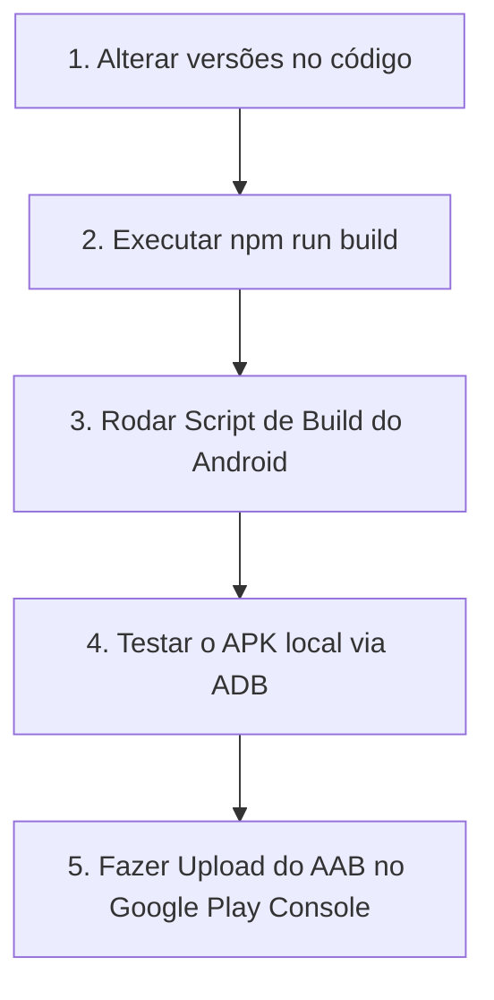

# Guia de Atualização do Aplicativo Android (Play Store & APK)

Este documento descreve o fluxo passo a passo para gerar novas versões do aplicativo Android (`.apk` e `.aab`) do **Evolução Clínica** garantindo que as correções de compatibilidade da SDK 36 e do manifesto não se percam.

---

## 📋 Resumo do Fluxo de Trabalho

Sempre que houver uma atualização no código do frontend (React) ou no manifesto do PWA, o fluxo é:



---

## 🛠️ Passo a Passo Detalhado

### Passo 1: Atualizar as Versões no Frontend
Abra o arquivo [AppVersion.tsx](file:///c:/PLATAFORMAS%20VS%20CODE/EVOLUÇÃO%20CLINICA/evolucao-clinica/src/components/layout/AppVersion.tsx) e incremente os números:
* `APP_VERSION`: Versão de exibição da build web (ex: `v1.10.409`).
* `PLAY_STORE_VERSION`: Versão de exibição na loja (ex: `1.0.11`).

### Passo 2: Compilar o Frontend
Gere os novos arquivos estáticos de produção do React rodando no terminal:
```bash
npm run build
```
*(Certifique-se de que a build completou com sucesso e os arquivos no diretório `dist/` foram atualizados).*

### Passo 3: Executar o Script Automatizado do Android
Para compilar e assinar o aplicativo Android de forma segura, use o script criado na pasta do projeto:
```bash
node .agents/build_bubblewrap.js
```

#### O que este script faz automaticamente por baixo dos panos?
1. Executa o `npx @bubblewrap/cli update` para baixar novos ícones do servidor e sincronizar configurações do PWA.
2. Interrompe processos travados no final da atualização (evita loops e travamento de terminal no Windows).
3. Configura a SDK local no arquivo `local.properties`.
4. Adiciona a flag `android.overridePathCheck=true` em `gradle.properties` e `app/gradle.properties` (necessário para compilar em computadores cujo caminho de diretório contenha caracteres especiais/acentuação).
5. Força a compilação do projeto sob a **SDK 36**.
6. Executa o build final do Android e assina automaticamente o `.apk` e o `.aab` usando o certificado `android.keystore` e a senha cadastrada (`evolucao123`).

---

## 📦 Artefatos Gerados

Após a conclusão com sucesso do script, dois arquivos principais serão gerados ou atualizados na raiz do projeto:

1. **`app-release-signed.apk`**: 
   * **Uso**: Teste manual nos celulares (instalação via USB ou download direto).
2. **`app-release-bundle.aab`**: 
   * **Uso**: Envio oficial para o **Google Play Console** (trilhas de Teste Interno, Fechado ou Produção).

---

## 🔑 Informações da Chave de Assinatura

* **Arquivo**: `android.keystore` (localizado na raiz do projeto).
* **Alias da Chave**: `android`
* **Senha do Keystore**: `evolucao123`
* **Senha do Alias (Key)**: `evolucao123`

> [!CAUTION]
> **Nunca perca ou altere este arquivo `android.keystore`.** Se ele for perdido, o Google Play Console não aceitará futuras atualizações do aplicativo e será necessário criar uma nova ficha na loja do zero.

---

## ⚠️ Regras Cruciais de Compatibilidade (Por que deu erro antes?)

Para evitar que o aplicativo pare de funcionar no futuro, lembre-se de duas regras fundamentais:

1. **Sem extensões de arquivos no shareTarget do `twa-manifest.json`**:
   O Android proíbe a declaração de extensões iniciando com ponto (ex: `.opus`, `.mp3`) no atributo `mimeType` das intents. Qualquer formato de arquivo aceito para compartilhamento no app deve ser mapeado por tipos genéricos (`audio/*`, `video/*`, `application/ogg`) ou curingas (`*/*`).
2. **Uso de SDK Compatível**:
   A biblioteca helper do Google exige a compilação com a SDK 36. O script garante que essa versão seja usada sem quebrar a execução nas plataformas de desenvolvimento locais.

---

## 📲 Como testar o APK no celular via USB (ADB)

Se você tem a depuração USB ativa no seu celular conectado por cabo:
```bash
# Para instalar o novo APK sobrescrevendo a versão anterior
adb install -r app-release-signed.apk
```
