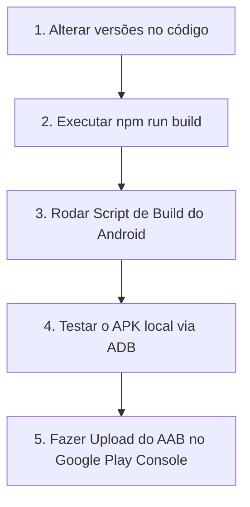

# Guia de Atualização do Aplicativo Android (Play Store & APK)

Este documento descreve o fluxo passo a passo para gerar novas versões do aplicativo Android (`.apk` e `.aab`) do **Evolução Clínica** garantindo que as correções de compatibilidade da SDK 36 e do manifesto não se percam.

---

## 📋 Resumo do Fluxo de Trabalho

Sempre que houver uma atualização no código do frontend (React) ou no manifesto do PWA, o fluxo é:


```mermaid
graph TD
    A[1. Alterar versões no código] --> B[2. Executar npm run build]
    B --> C[3. Rodar Script de Build do Android]
    C --> D[4. Testar o APK local via ADB]
    D --> E[5. Fazer Upload do AAB no Google Play Console]
```

---

## 🛠️ Passo a Passo Detalhado

### Passo 1: Atualizar as Versões no Frontend e no Android

Antes de alterar o frontend, determine o `versionCode` numérico em `app/build.gradle`. Esse número é a fonte de verdade para a versão da Play Store:

1. Defina `PLAY_STORE_VERSION` em [AppVersion.tsx](file:///c:/PLATAFORMAS%20VS%20CODE/EVOLUÇÃO%20CLINICA/evolucao-clinica/src/components/layout/AppVersion.tsx) como `1.0.<versionCode>`.
2. Mantenha `versionCode` e `versionName` em `app/build.gradle` com o mesmo número.
3. Mantenha `appVersionCode`, `appVersionName` e `appVersion` em `twa-manifest.json` com o mesmo número do `versionCode`.
4. Atualize `APP_VERSION` com a versão exibida no rodapé, seguindo o padrão `v1.10.X` para mudanças pequenas.

Exemplos:

* `versionCode 41` → `PLAY_STORE_VERSION = "1.0.41"`.
* `versionCode 46` → `PLAY_STORE_VERSION = "1.0.46"`.

Nunca incremente `PLAY_STORE_VERSION` separadamente do `versionCode`.

### Passo 2: Compilar o Frontend
Gere os novos arquivos estáticos de produção do React rodando no terminal:
```bash
npm run build
```
*(Certifique-se de que a build completou com sucesso e os arquivos no diretório `dist/` foram atualizados).*

### Passo 3: Assinar e gerar os artefatos

O build normal **não executa Bubblewrap**. Isso protege as personalizações nativas versionadas, incluindo WebView, FCM, Billing, seletor de arquivos e retorno OAuth do Google.

Configure as credenciais somente no ambiente da sessão de build. Nunca as coloque em `.env`, documentação, código ou Git:

```powershell
$env:JAVA_HOME = 'C:\Users\medei\.bubblewrap\jdk\jdk-17.0.11+9'
$env:ANDROID_KEYSTORE_PASSWORD = '<senha segura da chave>'
$env:ANDROID_KEY_PASSWORD = '<senha segura da chave>'
node .agents/build_bubblewrap.js
```

`ANDROID_KEY_ALIAS` é opcional (o padrão é `android`) e `ANDROID_KEYSTORE_PATH` pode apontar para uma chave fora do repositório. O script verifica a sincronização das versões, gera AAB e APK assinados, valida ambos com `jarsigner` e somente então atualiza os artefatos oficiais na raiz.

> Não execute `npx @bubblewrap/cli update` como parte de uma release rotineira. Quando houver necessidade real de atualizar ícones ou metadados gerados pelo Bubblewrap, faça isso em uma branch limpa, revise o diff completo do Android e confirme que as personalizações nativas foram preservadas antes de gerar a release.

---

## 📦 Artefatos Gerados

Após a conclusão com sucesso do script, dois arquivos principais serão gerados ou atualizados na raiz do projeto:

1. **`app-release-signed.apk`**: 
   * **Uso**: Teste manual nos celulares (instalação via USB ou download direto).
2. **`app-release-bundle.aab`**: 
   * **Uso**: Envio oficial para o **Google Play Console** (trilhas de Teste Interno, Fechado ou Produção).

---

## 🔑 Proteção da chave de assinatura

* A chave e suas senhas são segredos operacionais: mantenha-as em cofre de segredos ou no ambiente protegido de build.
* Não versione a chave, senhas, aliases privados ou arquivos de configuração local.
* Faça backup criptografado da chave e teste periodicamente a recuperação em ambiente controlado.
* A perda da chave de upload pode impedir futuras atualizações; siga o processo de recuperação de chave de upload do Google Play se isso ocorrer.

---

## ⚠️ Regras Cruciais de Compatibilidade (Por que deu erro antes?)

Para evitar que o aplicativo pare de funcionar no futuro, lembre-se de duas regras fundamentais:

1. **Sem extensões de arquivos no shareTarget do `twa-manifest.json`**:
   O Android proíbe a declaração de extensões iniciando com ponto (ex: `.opus`, `.mp3`) no atributo `mimeType` das intents. Qualquer formato de arquivo aceito para compartilhamento no app deve ser mapeado por tipos genéricos (`audio/*`, `video/*`, `application/ogg`) ou curingas (`*/*`).
2. **Uso de SDK Compatível**:
   A biblioteca helper do Google exige a compilação com a SDK 36. O script garante que essa versão seja usada sem quebrar a execução nas plataformas de desenvolvimento locais.

---

## 📲 Como testar o APK no celular via USB (ADB)

Se você tem a depuração USB ativa no seu celular conectado por cabo:
```bash
# Para instalar o novo APK sobrescrevendo a versão anterior
adb install -r app-release-signed.apk
```
