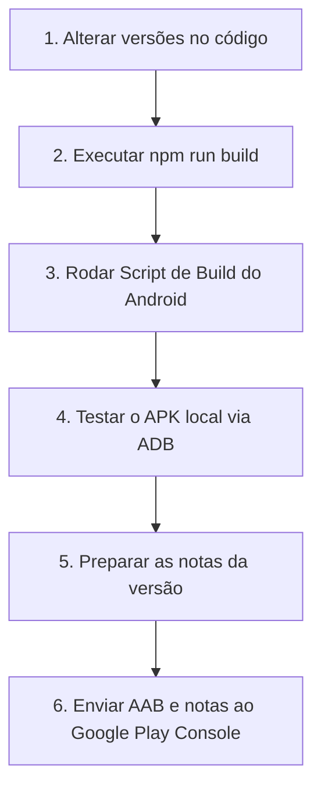

# Guia de Atualização do Aplicativo Android (Play Store & APK)

Este documento descreve o fluxo passo a passo para gerar novas versões do aplicativo Android (`.apk` e `.aab`) do **Evolução Clínica** garantindo que as correções de compatibilidade da SDK 36 e do manifesto não se percam.

---

## 📋 Resumo do Fluxo de Trabalho

Sempre que houver uma atualização no código do frontend (React) ou no manifesto do PWA, o fluxo é:


```mermaid
graph TD
    A[1. Alterar versões no código] --> B[2. Executar npm run build]
    B --> C[3. Rodar Script de Build do Android]
    C --> D[4. Testar o APK local via ADB]
    D --> E[5. Preparar as notas da versão]
    E --> F[6. Enviar AAB e notas ao Google Play Console]
```

---

## 🛠️ Passo a Passo Detalhado

### Passo 1: Atualizar as Versões no Frontend e no Android

Antes de alterar o frontend, determine o `versionCode` numérico em `app/build.gradle`. Esse número é a fonte de verdade para a versão da Play Store:

1. Defina `PLAY_STORE_VERSION` em [AppVersion.tsx](file:///c:/PLATAFORMAS%20VS%20CODE/EVOLUÇÃO%20CLINICA/evolucao-clinica/src/components/layout/AppVersion.tsx) como `1.0.<versionCode>`.
2. Mantenha `versionCode` e `versionName` em `app/build.gradle` com o mesmo número.
3. Mantenha `appVersionCode`, `appVersionName` e `appVersion` em `twa-manifest.json` com o mesmo número do `versionCode`.
4. Atualize `APP_VERSION` com a versão exibida no rodapé, seguindo o padrão `v1.10.X` para mudanças pequenas.

Exemplos:

* `versionCode 41` → `PLAY_STORE_VERSION = "1.0.41"`.
* `versionCode 46` → `PLAY_STORE_VERSION = "1.0.46"`.

Nunca incremente `PLAY_STORE_VERSION` separadamente do `versionCode`.

### Passo 2: Compilar o Frontend
Gere os novos arquivos estáticos de produção do React rodando no terminal:
```bash
npm run build
```
*(Certifique-se de que a build completou com sucesso e os arquivos no diretório `dist/` foram atualizados).*

### Passo 3: Configurar a assinatura nesta máquina (uma única vez)

O build normal **não executa Bubblewrap**. Isso protege as personalizações nativas versionadas, incluindo WebView, FCM, Billing, seletor de arquivos e retorno OAuth do Google.

O keystore e suas senhas não devem ficar no repositório, em `.env`, na documentação ou em scripts versionados. Nesta máquina Windows, execute uma única vez:

```powershell
.\.agents\setup_android_signing.ps1
```

O configurador:

1. valida a senha e o alias com `keytool`;
2. copia a chave para `%LOCALAPPDATA%\EvolucaoClinica\android-signing\upload.keystore`;
3. salva as senhas em `credentials.clixml`, criptografadas pelo DPAPI do Windows;
4. restringe a pasta ao usuário atual e ao `SYSTEM`.

O arquivo `credentials.clixml` só pode ser descriptografado pelo mesmo usuário na mesma instalação do Windows. Ele não substitui um backup externo e seguro do keystore e da senha.

### Passo 4: Assinar e gerar os artefatos

Depois da configuração inicial, cada nova release é gerada com:

```powershell
.\.agents\build_android_release.ps1
```

O comando recupera as credenciais protegidas somente durante o processo, executa `.agents/build_bubblewrap.js` e remove as senhas do ambiente ao terminar. O script verifica a sincronização das versões, gera AAB e APK assinados, valida ambos com `jarsigner` e somente então atualiza os artefatos oficiais na raiz.

Para um ambiente temporário ou CI, ainda é possível definir manualmente `ANDROID_KEYSTORE_PATH`, `ANDROID_KEY_ALIAS`, `ANDROID_KEYSTORE_PASSWORD` e `ANDROID_KEY_PASSWORD` e executar `node .agents/build_bubblewrap.js`.

> Não execute `npx @bubblewrap/cli update` como parte de uma release rotineira. Quando houver necessidade real de atualizar ícones ou metadados gerados pelo Bubblewrap, faça isso em uma branch limpa, revise o diff completo do Android e confirme que as personalizações nativas foram preservadas antes de gerar a release.

---

## 📦 Artefatos Gerados

Após a conclusão com sucesso do script, dois arquivos principais serão gerados ou atualizados na raiz do projeto:

1. **`app-release-signed.apk`**: 
   * **Uso**: Teste manual nos celulares (instalação via USB ou download direto).
2. **`app-release-bundle.aab`**: 
   * **Uso**: Envio oficial para o **Google Play Console** (trilhas de Teste Interno, Fechado ou Produção).

---

## 📝 Notas da versão obrigatórias

Sempre que um novo `.aab` for gerado, prepare e envie as notas da versão junto
com o artefato no Google Play Console. A publicação da versão Android não está
concluída sem essas notas.

1. Crie ou atualize `docs/RELEASE_NOTES_1.0.<versionCode>.md` com as mudanças
   visíveis para a pessoa usuária, correções relevantes e eventuais limitações.
2. Use o texto abaixo no campo de notas da versão do Google Play Console,
   substituindo somente o conteúdo entre as tags. Mantenha exatamente as tags
   de idioma `pt-BR`:

```text
<pt-BR>
Insira ou cole aqui as notas da versão no idioma pt-BR
</pt-BR>
```

3. Não inclua credenciais, tokens, URLs privadas, detalhes de infraestrutura ou
   dados de pacientes. Prefira linguagem clara, curta e orientada ao benefício.
4. Copie o mesmo texto final para o arquivo versionado em `docs/`, para que a
   versão enviada ao Play Console possa ser auditada posteriormente.

---

## 🏷️ Cupons no Stripe e no Google Play

O código de cupom é comum aos dois provedores, mas o desconto é aplicado de
forma diferente:

* No Stripe, o backend cria/aplica o cupom Stripe a partir do registro em
  `subscription_coupons`.
* No Google Play, crie primeiro uma oferta promocional no produto e no
  `base plan` correspondente. O campo **ID da oferta Google Play** no painel
  `/admin/coupons` deve receber exatamente o `offerId` publicado no Play
  Console, e não o código digitado pelo cliente.
* O app consulta a oferta elegível, abre o Billing com o `offerToken` retornado
  pelo Google Play e o backend confirma novamente o `offerId` antes de ativar o
  acesso. Um cupom sem oferta Google Play configurada continua válido apenas
  no Stripe.
* O valor financeiro e os eventos de conversão do Google Play só são gravados
  depois da confirmação autoritativa. Nunca substitua o preço do Play por um
  valor informado pelo cliente.

Ao testar, valide separadamente Stripe e Google Play. No modal do Play deve
aparecer o produto/oferta esperados e, para contas de teste, um instrumento de
teste; Pix ou cartão real devem ser cancelados imediatamente.

---

## 🔑 Proteção da chave de assinatura

* A cópia operacional desta máquina fica em `%LOCALAPPDATA%\EvolucaoClinica\android-signing`, nunca dentro do repositório.
* A chave e suas senhas são segredos operacionais: mantenha também um backup criptografado em um cofre de segredos.
* Não versione a chave, senhas, aliases privados ou arquivos de configuração local.
* Faça backup criptografado da chave e teste periodicamente a recuperação em ambiente controlado.
* A perda da chave de upload pode impedir futuras atualizações; siga o processo de recuperação de chave de upload do Google Play se isso ocorrer.
* Nunca recupere ou reutilize credenciais que tenham sido expostas em histórico Git. Faça a rotação da chave de upload no Google Play quando houver uma janela segura para isso.

---

## ⚠️ Regras Cruciais de Compatibilidade (Por que deu erro antes?)

Para evitar que o aplicativo pare de funcionar no futuro, lembre-se de duas regras fundamentais:

1. **Sem extensões de arquivos no shareTarget do `twa-manifest.json`**:
   O Android proíbe a declaração de extensões iniciando com ponto (ex: `.opus`, `.mp3`) no atributo `mimeType` das intents. Qualquer formato de arquivo aceito para compartilhamento no app deve ser mapeado por tipos genéricos (`audio/*`, `video/*`, `application/ogg`) ou curingas (`*/*`).
2. **Uso de SDK Compatível**:
   A biblioteca helper do Google exige a compilação com a SDK 36. O script garante que essa versão seja usada sem quebrar a execução nas plataformas de desenvolvimento locais.

---

## 📲 Como testar o APK no celular via USB (ADB)

Se você tem a depuração USB ativa no seu celular conectado por cabo:
```bash
# Para instalar o novo APK sobrescrevendo a versão anterior
adb install -r app-release-signed.apk
```
