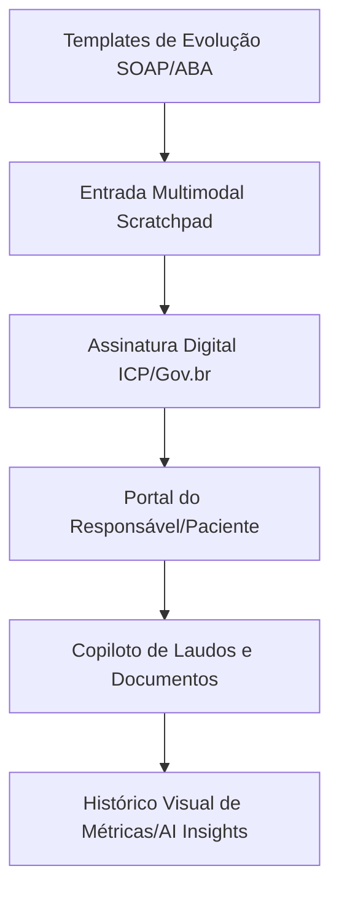

# Sugestões de Funcionalidades e Evolução da Plataforma

Este documento reúne propostas de melhorias, novos recursos e evoluções estratégicas para a plataforma de **Evolução Clínica**, organizadas por facilidade de implementação, impacto no usuário final e valor comercial para o modelo SaaS.

---

## 🗺️ Visão Geral do Roadmap Sugerido

---

## 🚀 Fase 1: Diferenciação Rápida e Redução de Atrito
*Foco: Funcionalidades de alta percepção de valor com esforço de desenvolvimento baixo/médio.*

### 1.1 Templates Personalizados de Evolução (Ex: SOAP, ABA, Psicanálise)
*   **Descrição:** Hoje o aplicativo usa um único padrão de IA para formatar a evolução. Esta funcionalidade permitirá que cada profissional escolha um template clínico antes de começar a ditar a sessão.
*   **Templates Comuns:**
    *   **SOAP:** *Subjective* (Subjetivo), *Objective* (Objetivo), *Assessment* (Avaliação), *Plan* (Plano). Muito usado na medicina, fisioterapia e terapia ocupacional.
    *   **ABA (Análise do Comportamento Aplicada):** Focado em metas de aprendizagem, respostas a estímulos e comportamentos de barreira (ideal para terapeutas do espectro autista).
    *   **Prontuário Narrativo:** Texto corrido, focado na livre associação (psicanálise clássica).
*   **Estrutura Técnica sugerida:**
    *   Tabela `evolution_templates` (`id`, `professional_id` (opcional para templates globais), `name`, `system_prompt_instruction`).
    *   Dropdown na tela `NewEvolution.tsx` para selecionar o modelo desejado.
*   **Valor:** Expande o mercado-alvo do app para qualquer especialidade de saúde.

### 1.2 Scratchpad de Apoio (Entrada Multimodal Texto + Áudio)
*   **Descrição:** Um bloco de notas rápido na tela de gravação onde o terapeuta pode digitar palavras-chave, nomes de medicamentos complexos, CIDs ou termos difíceis que a IA poderia ouvir errado.
*   **Funcionamento:** O texto do Scratchpad é enviado junto com o áudio no prompt do Gemini como "Contexto Adicional de Apoio".
*   **Valor:** Reduz em 90% a necessidade de edição manual pós-transcrição.

---

## 🔐 Fase 2: Segurança Regulatória e Profissionalização
*Foco: Tornar a plataforma 100% em conformidade com as regras dos Conselhos Federais de Saúde (CFP, CREFITO, CREFONO, etc.).*

### 2.1 Assinatura Digital e Fechamento de Evolução
*   **Descrição:** No Brasil, prontuários eletrônicos devem ter garantia de que não foram adulterados retroativamente.
*   **Funcionamento:**
    *   Após criar ou revisar a evolução, o profissional clica em **"Assinar e Fechar"**.
    *   O status da evolução muda para `signed` e ela torna-se **somente leitura**.
    *   Integração com assinatura eletrônica gratuita do **Gov.br** ou chave de assinatura do próprio app com carimbo de data, hora e IP do profissional.
*   **Valor:** Proteção jurídica completa para o profissional de saúde em caso de fiscalização dos conselhos ou processos.

### 2.2 Controle Financeiro de Sessões Simplificado
*   **Descrição:** Vincular o valor cobrado por sessão ao fluxo de evoluções dos pacientes.
*   **Recursos:**
    *   Campo "Valor da Sessão" no cadastro do paciente.
    *   Histórico de faturamento bruto baseado nas sessões gravadas/evoluídas.
    *   Relatório de sessões a cobrar (ex: "Pacientes com pacotes pendentes de pagamento").
*   **Valor:** Transforma o app em uma ferramenta de gestão diária essencial para o terapeuta autônomo.

---

## 📈 Fase 3: Geração de Relatórios e Inteligência Clínica
*Foco: Automatizar o trabalho administrativo mais pesado do terapeuta.*

### 3.1 Copiloto para Laudos, Atestados e Encaminhamentos (PDF)
*   **Descrição:** O terapeuta gasta cerca de 30 a 50 minutos para escrever relatórios estruturados para escolas, planos de saúde ou médicos parceiros (neuropediatras, psiquiatras).
*   **Funcionamento:**
    *   A IA analisa o histórico de evoluções anteriores de um período selecionado.
    *   Gera um rascunho completo de laudo de evolução clínica ou encaminhamento profissional.
    *   O sistema exporta para um PDF formatado com papel timbrado (logotipo e cores do profissional configurados nas preferências de marca).
*   **Valor:** Economia gigantesca de tempo administrativo para o profissional.

### 3.2 Painel Visual de Progresso (AI Insights)
*   **Descrição:** Gráficos que demonstram visualmente o avanço do paciente baseado na análise semântica das evoluções pela IA.
*   **Recursos:**
    *   Métricas como: *Nível de Engajamento*, *Adesão às Atividades para Casa*, *Estabilidade Emocional*, e *Evolução Motora*.
    *   Gráfico de linha mostrando a evolução desses sentimentos/notas ao longo das semanas.
*   **Valor:** Uma ferramenta visual incrível para o profissional mostrar aos pais ou médicos em reuniões de discussão de caso.

---

## 🤝 Fase 4: Integração Familiar e do Paciente
*Foco: Criar canais de comunicação seguros e práticos.*

### 4.1 Portal do Responsável (Link Seguro / Área do Paciente)
*   **Descrição:** Compartilhar tarefas para casa e feedbacks clínicos de forma profissional, segura e sem poluir o WhatsApp do terapeuta.
*   **Funcionamento:**
    *   O profissional gera um link público seguro (com senha ou token temporário).
    *   O responsável acessa uma página otimizada para celular contendo as orientações para casa geradas pela IA e o Plano de Desenvolvimento Individual (PDI) ativo.
*   **Valor:** Melhora absurda na percepção de valor do serviço prestado pelo terapeuta aos olhos da família.

---

## 🔮 Fase 5: Recursos Avançados e Inteligência Preditiva (Disruptivo)
*Foco: Funcionalidades inovadoras para escala e retenção de clientes.*

### 5.1 Busca Semântica em Prontuários (RAG Clínico)
*   **Descrição:** Conforme o prontuário do paciente cresce, encontrar uma informação específica (ex: dosagem de medicamento anterior, sintomas relatados há meses) torna-se difícil.
*   **Funcionamento:**
    *   A IA indexa semanticamente todas as evoluções do paciente.
    *   O terapeuta pode fazer perguntas em linguagem natural na página do paciente: *"Qual foi a última dosagem de Ritalina mencionada pelo médico?"* ou *"Quando o paciente começou a apresentar resistência ao contato visual?"*.
    *   O sistema responde instantaneamente com as datas e trechos exatos das evoluções correspondentes.
*   **Valor:** Resgate imediato de informações valiosas sem necessidade de releitura manual de dezenas de páginas.

### 5.2 Alertas de Absenteísmo e Evasão de Pacientes (Prevenção de Churn)
*   **Descrição:** Pacientes que faltam muito ou interrompem a terapia sem alta formal geram prejuízos e quebra no tratamento.
*   **Funcionamento:**
    *   O sistema analisa o fluxo de agendamentos no Google Calendar e a criação de evoluções.
    *   Dispara alertas automáticos: *"Alerta: O paciente João não comparece há 14 dias e não possui agendamento futuro. Deseja enviar uma mensagem de acompanhamento?"*.
*   **Valor:** Aumenta a retenção de pacientes e otimiza a ocupação de horários da clínica.

### 5.3 Copiloto para Faturamento de Convênios (Padrão TISS / Tabela TUSS)
*   **Descrição:** Profissionais que atendem planos de saúde gastam horas preenchendo guias TISS com códigos de procedimentos complexos (Tabela TUSS).
*   **Funcionamento:**
    *   Com base no texto da evolução, a IA identifica o tipo de intervenção (ex: psicoterapia individual, reabilitação neuropsicológica).
    *   Sugere os códigos TUSS corretos e pré-preenche um espelho da guia de faturamento para exportação ou cópia rápida.
*   **Valor:** Elimina a glosa de guias por erros de digitação e reduz o tempo de faturamento mensal.

### 5.4 Modo Copiloto de Sessão Completa (Gravação de Ambiente)
*   **Descrição:** Ao invés de o terapeuta gravar um áudio sintetizando o que aconteceu ao final do atendimento, ele grava toda a sessão de 50 minutos.
*   **Funcionamento:**
    *   O app grava a sessão inteira e utiliza um modelo de contexto longo para transcrever e extrair apenas os pontos cruciais: momentos de crise, conquistas de metas do PDI, combinados para a próxima sessão e reações do paciente.
*   **Valor:** Permite ao terapeuta focar 100% no paciente durante a sessão, sem precisar fazer anotações mentais ou de papel.

---

## 👥 Fase 6: Colaboração Multidisciplinar e Farmacologia (Visão de Ecossistema)
*Foco: Interação com outros profissionais e acompanhamento clínico médico.*

### 6.1 Compartilhamento Seguro Multidisciplinar (Equipe de Cuidados)
*   **Descrição:** Casos complexos de pacientes (como no autismo ou reabilitação) costumam ser atendidos por equipes multidisciplinares (Psicólogo, TO, Fonoaudiólogo, Psiquiatra).
*   **Funcionamento:**
    *   Permitir que terapeutas de diferentes clínicas que atendem o mesmo paciente compartilhem (com autorização expressa dos pais/paciente) metas específicas do PDI e resumos de evolução.
*   **Valor:** Integração real do tratamento, permitindo que o fonoaudiólogo saiba o que o psicólogo trabalhou naquela semana e vice-versa.

### 6.2 Separação de Vozes na Transcrição (Diariação de Oradores)
*   **Descrição:** Em sessões com gravação ambiental ou sessões de terapia familiar e de casal, o áudio contém a fala de mais de uma pessoa.
*   **Funcionamento:**
    *   A IA separa automaticamente quem está falando no texto final (ex: "Terapeuta:", "Paciente:", "Acompanhante:").
*   **Valor:** Transcrições mais fiéis à dinâmica real da sessão terapêutica de grupo ou familiar.

### 6.3 Monitoramento de Medicamentos e Efeitos Colaterais
*   **Descrição:** Terapeutas observam diariamente os efeitos práticos das medicações prescritas por psiquiatras ou neurologistas.
*   **Funcionamento:**
    *   O terapeuta cadastra a medicação atual do paciente.
    *   A IA monitora as evoluções clínicas em busca de menções a efeitos colaterais ou melhora de sintomas relacionados ao remédio (ex: irritabilidade, sono, foco).
    *   O app gera um relatório de eficácia farmacológica para o terapeuta entregar ao médico assistente do paciente.
*   **Valor:** Estreita a parceria científica entre o terapeuta e os médicos prescritores.

